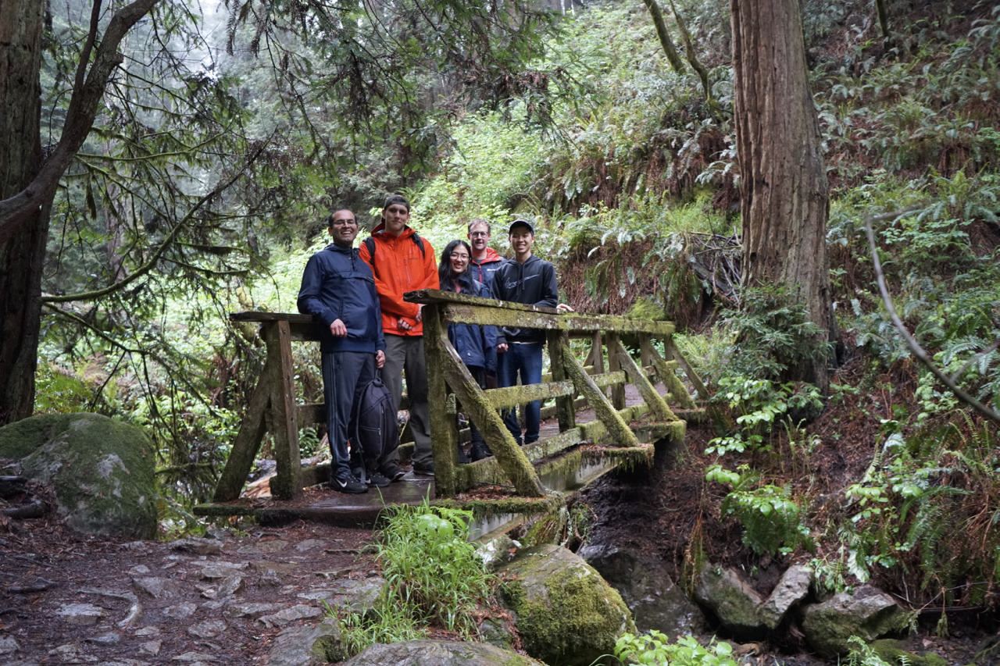

# Group events

Some of the regular things we do as a group are:&#x20;

* Lunch every two weeks jointly with our group and members of Persson research group
* \~Monthly coffee hour at Molecular Foundry
* Twice-yearly “CodeBusters” events, where we spend 3 days hacking on code together
* Twice-yearly “Work Away From Work” where we can share some interesting space to work that it’s not the LBNL main site
* Yearly “Group Day” where we share our work, have discussions, and zoom out on the big picture of our group
* Sporadic events such as group hikes

<figure><figcaption>
<em>A hike on the Matt Davis - Steep Ravine trail.</em>
</figcaption></figure>
