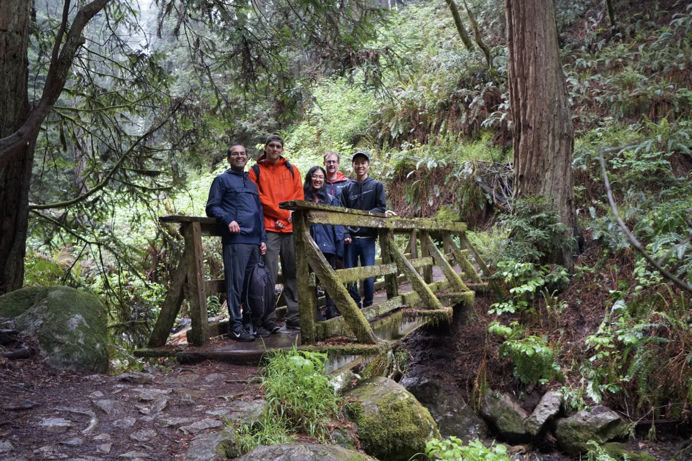

# Group meetings

There a few types of group meetings that you should make sure you have calendar invitations for:

* Biweekly meetings with Anubhav – these are 30-minute, 1:1 meetings where we discuss your project and anything else you'd like to discuss. You do not need to present slides or prepare any formal presentation. Some of the things you can do during these checkups:
  * mention anything that is impeding your progress (e.g., lack of equipment, lack of response from a collaborator, long queue wait times at supercomputer, etc.)
  * report what you worked on the last week and present your goals for the next week, month, or 3 months to confirm that you are on the right track, not repeating previous work, etc.
  * introduce a major problem you are facing and that requires a longer, targeted meeting to brainstorm a solution (just present the problem in enough detail)
  * solve very small problems, such as getting feedback on 3-4 presentation slides
  * request a decision about something
* Biweekly "Teach Me Anything Day" group meetings – our entire research group meets for 1 hour every two weeks and someone in the group (sometimes Anubhav) presents on any topic of their choosing.
* Project meetings – your specific project will likely have some kind of recurring meetings
* Finally, we have biannual "Group Day" meetings that are scheduled a month or so in advance (so no calendar invite until they happen). These are longer group meetings where we present our research projects to one another.

We have lunch every two weeks jointly with our group and members of Persson research group. We also have group events from time to time, see some pictures below!

<figure><figcaption>
Hiking the Matt Davis trail in Marin
</figcaption></figure>

<figure><figcaption>
Bowling in Oakland
</figcaption></figure>
